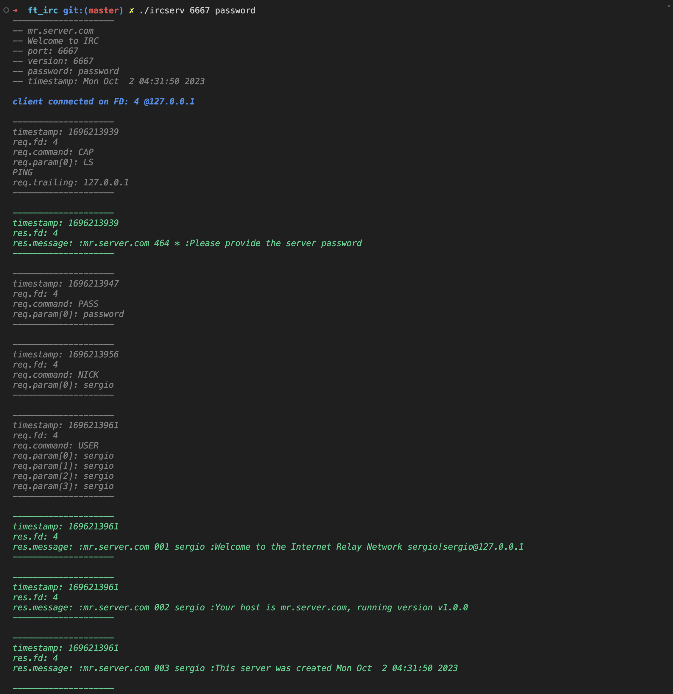
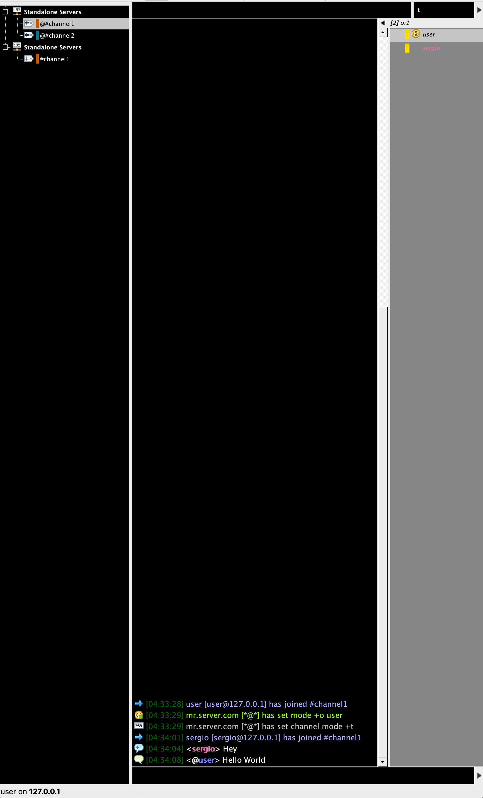

# Ft_IRC

IRC (Internet Relay Chat) server

Run server
- make
- usage: "./ircserv <port> <password>"

Download Client (KVIRC)
- make irc

Run server with Valgrind && Docker
- docker build -t irc .
- docker run -p 6667:6667 irc

